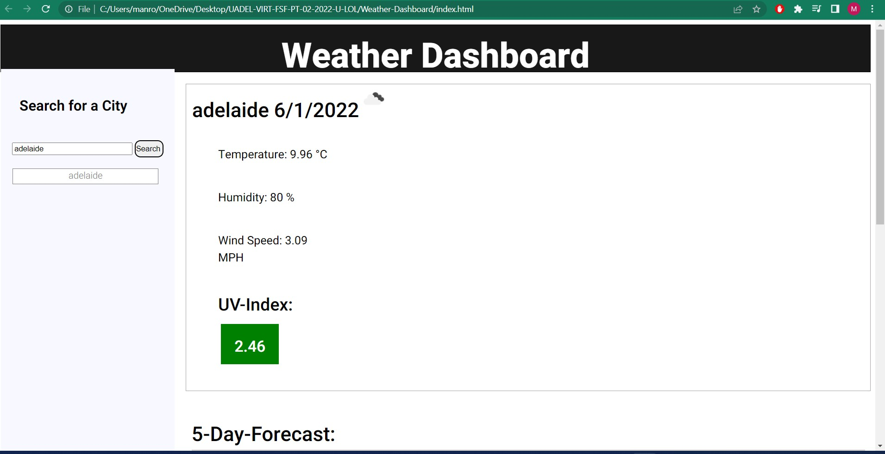

# Weather-Dashboard
<h1> Description<h1>

 Knowing the weather is required by many people from different walks of life to farmers for there crops to everyday people so they can dress appropriately for the weather. This weather application uses html and css code for the design of the website. Javascript is used to make the website functional, the weather data is retrieved from a serverside api called 'OpenWeather'. 

 